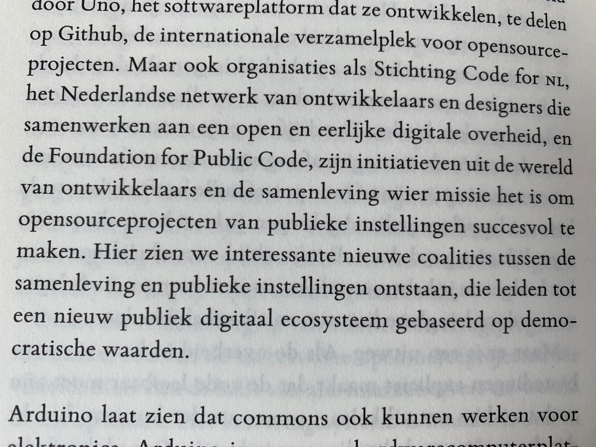

# Press and media

These are selected press articles about us.If you're a journalist who wants to write about us, we're happy to help. Email us at <press@publiccode.net>. 

You may also be interested in:

- [a list of policy documents that mention us](https://about.publiccode.net/activities/value-and-impact/policy-documents.html)
- [our conference talks and articles we've written]https://projects.publiccode.net/talks-and-articles.html()
- [our conference talks and articles we've written](https://projects.publiccode.net/talks-and-articles.html)

## 2020

> Quote: "Not only does going open-source offer cities access to fresh ideas, he says, but it helps policymakers better understand the software itself. After all, says Cerveny, “software will almost always be the way that policy is implemented in the future.”")
- [5 big ideas for fixing global cities’ most daunting challenges](https://fortune.com/2020/02/17/cities-challenges-solutions-housing-buses-climate-loneliness/) by Lydia Belanger and Emma Hinchliffe in Fortune.com (February 2020) 

> "It’s also important proof of the ability of globally diverse, digitally-connected civic technology communities to reliably compete with for-profit government technology vendors. This trend is gaining steam, with the Foundation for Public Code linking a network of municipal peer partners and the Beeck Center’s just-launched State Software Collaborative looking to improve US states’ procurement processes, in-house tech development, and inter-state sharing.
- [Next-Generation Engagement Platforms, and How They Are Useful Right Now (Part 1)](https://civichall.org/civicist/next-generation-engagement-platforms-and-how-are-they-useful-right-now-part-1/), by Matt Stempeck on CivicHall.org (May 2020) 
- [The sixth version of Standard for Public Code has been released on GitHub and the development of version 0.2.1 is open for contributions](https://joinup.ec.europa.eu/collection/open-source-observatory-osor/news/new-release-standard-public-code), by Charlotte Heikendorf on the [Open Source Observatory](https://joinup.ec.europa.eu/collection/open-source-observatory-osor) (OSOR) (May 2020)

- [Public Interest Podcast](https://public-interest-podcast.podigee.io/2-episode-2) interview with Olaf-Gerd Gemein about applying the Standard for Public Code in Germany (in German) (June 2020)

> "Foundation for Public Code won de Aanmoedigingsprijs 2020, de jury ziet veel potentie in het initiatief en ziet uit naar een structurele bijdrage aan een gezonde open source-cultuur binnen de publieke sector"
- [Sylk Suite wint Innovatie-award 2020](https://awards.isoc.nl/innovatie/2020/) (in Dutch) - press release announcing that we've won the 2020 Internet Society Netherlands encouragment award (June 2020); see also [our blogpost](https://blog.publiccode.net/news/2020/06/17/isoc-encouragement-award-consider-us-encouraged.html). 

> "Transparency should be an essential requirement in software developed by governments. Initiatives like Public Money, Public Code and the Foundation for Public Code are doing an amazing job of helping public administrators understand why their code (our code as taxpayers) should be open source."
- [Open source development works to improve contact tracing in Europe](https://opensource.com/article/20/7/open-source-contact-tracing) by  J. Manrique Lopez de la Fuente on Opensource.com (July 2020) 

## 2019

- [Foundation for Public Code: How to help governments develop high-quality, sustainable, cost-effective, and low-risk public services through open source collaborations](https://os2.eu/blog/foundation-public-code-how-help-governments-develop-high-quality-sustainable-cost-effective-and) - an interview by OS2 with Boris van Hoytemaa and Claus Mullie (September 2019)
- Marleen Stikker's book [Het internet is stuk](https://www.singeluitgeverijen.nl/de-geus/boek/het-internet-is-stuk/) (in Dutch) (November 2019)
